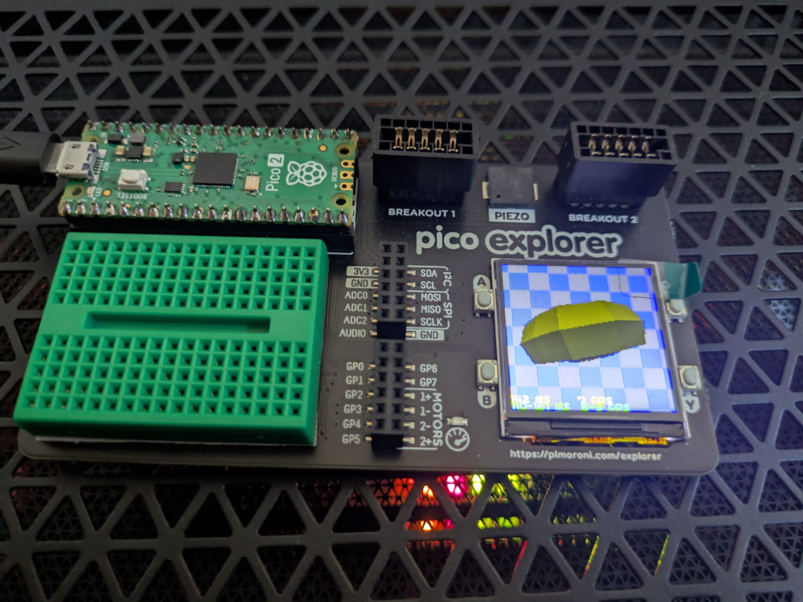

# pico-donut

This is a port of the donut.c version from:

https://www.a1k0n.net/2025/01/10/tiny-tapeout-donut.html

I have basically mimic the behaviour or his demo, fps is about 7-8 fps in a pico2 displaying to st7789 (240x240) but drawing donut at 120x120 resolution.

This is the result: 

Install Intruccions:

1. Import project into raspberry pico vs code extension

2. It will run straightforward with raspberry pico explorer from pimoroni, button is assumed to be Y (gpio 15)

